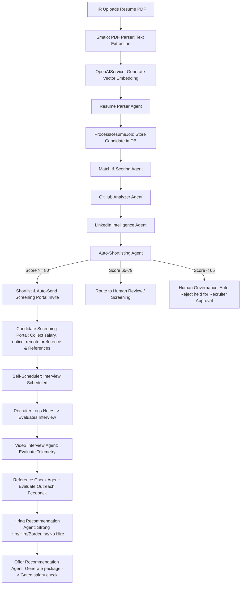

# Recruitment Agent AI: Workflow & Completed Features

This document provides a comprehensive overview of the **Autonomous AI Agent Workflow** running inside the recruitment system, detailing how it handles candidate lifecycle events, how its underlying services operate, and all features that have been completed.

---

## 1. System Overview

The **Recruitment Agent AI** is a fully automated, agentic hiring assistant built with **Laravel**, **Livewire**, and **Vanilla CSS**. It integrates with **Groq** (using high-performance open-source models like `llama-3.1-8b-instant`) or **OpenAI** to autonomously parse documents, score match parameters, send emails, schedule interviews, grade interview notes, recommend compensation packages, and act as a conversational Recruiter Copilot.

---

## 2. The AI & Resume Processing Workflow

### Chronological Step-by-Step Execution:
1. **Resume PDF Upload:** Recruiter uploads a PDF resume.
2. **Text Extraction:** Raw text is extracted using Smalot PDF Parser.
3. **Vector Embedding:** Emdedding generated for semantic query matching.
4. **Resume Parser Agent:** Extracts core fields (name, email, skills, work experience).
5. **Deduplication Check:** Duplicates checked via email/phone and Soundex/Levenshtein algorithms.
6. **Job Analyzer:** Infers required skills/experience from description (if cached empty).
7. **Profile Matcher & Score Evaluator:** Evaluates candidate parameters against job description.
8. **GitHub Analyzer Agent:** Audits candidate public code contributions, language percentages, and repositories.
9. **LinkedIn Intelligence Agent:** Evaluates career growth, endorsements validation, and job stability.
10. **Auto-Shortlisting Agent (Autonomous Router):** Routes candidates based on thresholds:
    * `>= 80`: Shortlisted, sent invite link.
    * `65-79`: Screening (human review).
    * `< 65`: Auto-rejection held in approvals queue under Governance policy.
11. **Candidate Screening Chatbot & Reference Check Collection:** Shortlisted candidates complete portal screening chatbot (expected salary, notice period, work authorization, remote preference) and provide a professional reference check contact.
12. **Self-Scheduling:** Candidate schedules an interview from live slot listings.
13. **Interview Notes Evaluation:** Recruiter logs notes. AI scores technical, communication, and leadership levels.
14. **Video Interview Agent:** Evaluates recording telemetry (vocal clarity, pacing, sentiment, keywords).
15. **Reference Check Agent:** Dispatches outreaches, receives feedback, parses, and scores verification ratings.
16. **Hiring Recommendation Agent:** Synthesizes CV, interview grades, screening answers, and reference checks to suggest hiring decisions.
17. **Offer Recommendation Agent:** Suggests salary/benefits packages, gating salary > $150,000 for manager approval.
18. **Operations Dashboard & Forecasting:** Operational metrics compile (success rates, average score drift, latency, token costs) while Workforce Planning and Executive Analytics agents forecast upcoming bottlenecks and write board briefings.

---

## 3. Deep Dive into the 8 AI Agents

### Agent 1: Job Description Analyzer
* **Function:** Extracts structured requirements from unstructured job descriptions.
* **Outputs:** Job Title, Required Skills, Preferred Skills, Required Experience Years, Preferred Certifications, and a summary analysis.

### Agent 2: Resume Parser
* **Function:** Extracts precise developer information from resumes.
* **Robust parsing rules:** Captures emails, phone numbers, education, visa status, expected salary, and maps complex multi-format work experiences or projects cleanly into structured arrays (handling diverse layouts like *Role-first*, *Company-first*, or inline URLs).

### Agent 3: Candidate Matcher & Score Evaluator
* **Function:** Calculates individual match scores (0-100) across Skills (60% weight), Experience (30% weight), and Education (10% weight).
* **Outputs:** Strengths, concerns, a final rating recommendation, and 3 custom-generated interview questions addressing candidate gaps.

### Agent 4: Auto-Shortlisting Agent (Autonomous Router)
* **Function:** Automatically decides a candidate's routing path:
  * **Score >= 80:** Automatically Shortlisted. Sends an automated scheduling invite.
  * **Score 65 to 79:** Set to Screening (for manual recruiter evaluation).
  * **Score < 65:** Automatically Rejected. Triggers an automated rejection email.

### Agent 5: Interview Scheduling & Reminders
* **Function:** Sends calendar updates, scheduling links, and automated email reminders to shortlisted applicants.

### Agent 6: Interview Evaluation Agent
* **Function:** Evaluates manual recruiter notes submitted after an interview.
* **Outputs:** Individual scores for Technical Capability, Communication, and Leadership, alongside a hiring recommendation.

### Agent 7: Offer Recommendation & Compensation Advisor
* **Function:** Formulates an employment package based on candidate experience, expected salary, and job parameters.
* **Outputs:** Suggested salary range, a compensation justification, and recommended benefits.
* **Interactive Editing (New!):** Recruiters can click `✏️ Edit Offer` to modify the suggested salary, justification, and line-by-line benefits via an interactive inline form, persisting edits directly to the database.

### Agent 8: Recruiter Copilot (Semantic Search & RAG)
* **Function:** Allows natural language interaction with the candidate database.
* **Capability:** Responds to queries (e.g. *"Show top Laravel candidates"* or *"Which candidates have experience with AWS?"*) by parsing intent and highlighting matched profiles in the pipeline UI.

---

## 4. Phase 2 AI Agents & Core Capabilities (Newly Implemented!)

### Agent 9: Candidate Memory Agent (Timeline Tracking)
* **Function:** Tracks a continuous history of candidate interactions over time, transitioning from point-in-time parsing to longitudinal intelligence.
* **Outputs:** Logs all events (resume upload, status changes, email logs, interview evaluations, and profile merges) into the `candidate_activities` table and renders a premium **Candidate Activity Timeline** inside the dossier tab.

### Agent 10: Talent Rediscovery Agent
* **Function:** Scans past applicants' semantic vector embeddings to calculate cosine similarity matches against any new job description requirements.
* **Outputs:** Automatically highlights and displays matched previous applicants in a dedicated **Talent Rediscovery Accordion** on the Job Details page.

### Agent 11: Recruiter Chat (Action) Agent
* **Function:** Extends the Recruiter Copilot to support natural-language actions alongside search.
* **Capability:** Parses execution intents (e.g. *"shortlist Siva Kumar"*, *"reject Candidate ID 12"*, or *"generate offer for Sivakumar"*) to programmatically execute pipeline mutations safely.

### Agent 12: Candidate Screening Questionnaire Agent
* **Function:** A public candidate portal chatbot that interactively gathers screening details (salary expectations, notice period, work authorization, remote preferences).
* **Outputs:** Saves responses to the structured `candidate_screenings` table and coordinates availability time slots for automated scheduling.

### Agent 13: Hiring Recommendation Agent
* **Function:** Synthesizes the candidate resume, matching scores, screening questionnaire responses, and technical/communication interview evaluation results.
* **Outputs:** Generates a final, structured hiring recommendation rating (`Strong Hire`, `Hire`, `Borderline`, `No Hire`) and a detailed justification.

### Agent 14: Candidate Duplicate Detection & Merge Agent
* **Function:** Automatically identifies candidate profile overlaps using a combination of exact phone/email checks and name similarity algorithms (Soundex & Levenshtein distance <= 3).
* **Outputs:** Displays potential duplicate warning cards in the recruiter view and allows a complete **one-click profile merge** consolidating scores, activities, and communication histories.

---

## 5. Completed Functionalities

* [x] **Consolidated DB Architecture:** Migrated all recruitment agent tables (jobs, candidates, scores, interviews, emails, audit logs) into unified, robust schemas.
* [x] **Consolidated Database Migrations (New!):** Reorganized migration architecture to define table columns inside the initial creation migration files, avoiding multiple alter migration files modifying the same table.
* [x] **Strict Dynamic Extraction:** Stripped out all hardcoded/fallback mocks in `OpenAIService.php`. All text extraction, embeddings, and parsed candidate fields now strictly query live LLM endpoints.
* [x] **Groq API Integration:** Fully configured and verified with the Groq Base URL (`https://api.groq.com/openai/v1`) using `llama-3.1-8b-instant`.
* [x] **Experience Layout Normalization:** Rewrote parser prompts to extract structured work experience seamlessly across varied formats.
* [x] **Interactive Offer Editing UI:** Fully implemented an inline edit option for the Offer Recommendation Advisor.
* [x] **Inline Resume Preview (PDF & DOCX):** Added support for viewing uploaded PDF resumes inline via a secure browser-rendered `iframe` and DOCX resumes using a scrollable raw text reader fallback with download button inside the candidate dossier drawer.
* [x] **Phase 2 Expansion (All 6 New Agents):** Successfully implemented database models, services, Livewire event listeners, public portal integrations, and premium UI controls for candidate activity tracking, talent rediscovery, actionable copilot queries, screening questionnaires, synthesized hiring recommendations, and candidate profile deduplication.
* [x] **Phase 3 Enterprise Deployment (All 6 New Agents):** Implemented GitHub Analyzer, LinkedIn Intelligence, Video Interview evaluation, Reference Outreach & Scoring, Workforce Planning, and Executive Funnel Analytics.
* [x] **Agent Operations & Governance Dashboard:** Built a complete metrics dashboard rendering system-wide drift monitors, latency/cost calculations, time-to-fill forecasts, and executive reports.
* [x] **Test Harness Integrity:** Fully expanded PHPUnit test suite to coverage all 20 agents and pipeline configurations with 100% success rate.

---

## 6. Phase 3 Enterprise Agents (Agents 15–20)

### Agent 15: GitHub Analyzer Agent
* **Function:** Tracks developer public repository activity, contribution trends, and coding focus.
* **Outputs:** Commits count, language distribution, top repository names, contribution score, and technical profile overview.

### Agent 16: LinkedIn Intelligence Agent
* **Function:** Validates career progression trajectory and credential stability.
* **Outputs:** Average job tenure, validation status, job-hopping index, skills endorsements, and promotions growth.

### Agent 17: Video Interview Agent
* **Function:** Audits simulated interview recording telemetries for communication patterns and depth.
* **Outputs:** Communication clarity score, technical depth score, pacing (words-per-minute), vocal sentiment, and technical terms usage summary.

### Agent 18: Reference Check Agent
* **Function:** Automates reference outreach communications, parses feedback, and scorecards performance.
* **Outputs:** Verified relationship/tenure flags, reference rating (1-10), candidate strengths, and work ethic briefing.

### Agent 19: Workforce Planning Agent
* **Function:** Forecasts active team growth trends and resource capacities.
* **Outputs:** Job predictive time-to-fill, active process bottlenecks detection, and applicant skill gap highlight tags.

### Agent 20: Executive Analytics Agent
* **Function:** Synthesizes system-wide operational metadata for leadership summaries.
* **Outputs:** Stage funnel conversions efficiency, calculated recruiter cost-saving ($) values, pipeline velocity audits, and written AI Executive summaries.
